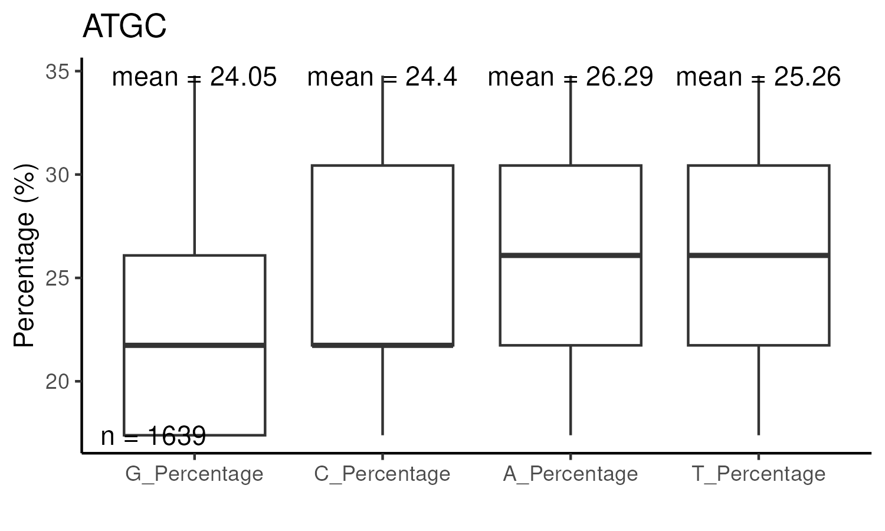
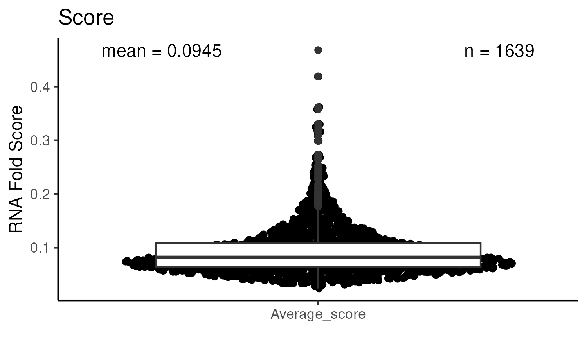
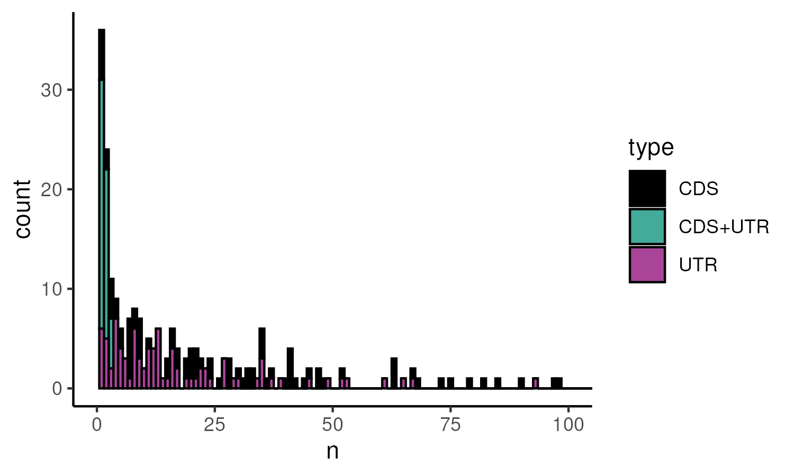

# gRNASelect: A package to select gRNAs based on RNA Fold scores and mismatches to the transcriptome
It is specifically designed for the Bazzini Lab at Stowers Institute for Medical Research utilizing the outputs from [gRNADesign](https://github.com/hzuzu/gRNADesign/).

## Instalation
You can install the released version from GitHub with:
```
# install.packages("devtools")
devtools::install_github("GabPescador/gRNASelect")
```

## Example
This is a basic example which shows how the functions select gRNAs per gene based on ATGC% and RNA Fold scores.
```
library(gRNASelect)
head(RNAFoldOutput, n=2)
#>                                         gRNA_name                seq_23nt
                                            <char>                  <char>
1: ENSDART00000136386_ENSDARG00000092856_1107_1129 TTTTTTTTTTTTTTTCGTCAGTC
2:   ENSDART00000136386_ENSDARG00000092856_126_148 CAAATTCAGCCACATTCAAAACC
                 Gene|Longest_transcript Seq_start Seq_end Average_score G_Percentage C_Percentage
                                  <char>     <int>   <int>         <num>        <num>        <num>
1: ENSDART00000136386_ENSDARG00000092856      1107    1129         0.453        8.696       13.043
2: ENSDART00000136386_ENSDARG00000092856       126     148         0.425        4.348       34.783
   A_Percentage T_Percentage      Transcript_ID CDS_UTR
          <num>        <num>             <char>  <char>
1:        4.348       73.913 ENSDART00000136386   3UTR3
2:       43.478       17.391 ENSDART00000136386   5UTR1
```

You can filter gRNAs based on a range of ATGC percentages.
```
atgc_filtered <- gRNAatgcFilter(RNAFoldOutput)
summary(atgc_filtered)
#>  gRNA_name           seq_23nt         Gene|Longest_transcript   Seq_start        Seq_end     
 Length:5261        Length:5261        Length:5261             Min.   :    1   Min.   :   23  
 Class :character   Class :character   Class :character        1st Qu.:  611   1st Qu.:  633  
 Mode  :character   Mode  :character   Mode  :character        Median : 1394   Median : 1416  
                                                               Mean   : 2104   Mean   : 2126  
                                                               3rd Qu.: 2915   3rd Qu.: 2937  
                                                               Max.   :10809   Max.   :10831  
 Average_score      G_Percentage    C_Percentage    A_Percentage    T_Percentage  
 Min.   :0.02400   Min.   :17.39   Min.   :17.39   Min.   :17.39   Min.   :17.39  
 1st Qu.:0.06200   1st Qu.:21.74   1st Qu.:21.74   1st Qu.:21.74   1st Qu.:21.74  
 Median :0.07700   Median :26.09   Median :26.09   Median :26.09   Median :26.09  
 Mean   :0.08383   Mean   :24.50   Mean   :24.56   Mean   :25.89   Mean   :25.05  
 3rd Qu.:0.09700   3rd Qu.:30.43   3rd Qu.:30.43   3rd Qu.:30.43   3rd Qu.:30.43  
 Max.   :0.46800   Max.   :34.78   Max.   :34.78   Max.   :34.78   Max.   :34.78  
 Transcript_ID        CDS_UTR              type          
 Length:5261        Length:5261        Length:5261       
 Class :character   Class :character   Class :character  
 Mode  :character   Mode  :character   Mode  :character  
```

Combined to the ATGC filter, or not, you can also select gRNAs based on their RNA Fold scores. The function will select the top and bottom scores, then select random scores for the leftover gRNAs. Since the default for us is 10 gRNAs per gene, if any gene has less than 10 predicted gRNAs it will select all of them.
```
filteredgRNAs <- gRNASelection(y, minN = 10, randomN = 8)
head(filteredgRNAs, n=2)
#> gRNA_name                seq_23nt
                                         <char>                  <char>
1:  ENSDART00000183252_ENSDARG00000091905_56_78 GATCTGCGTCTAAGCTCAAGAAA
2: ENSDART00000183252_ENSDARG00000091905_85_107 CCAAATGTCCGCGACCTTATCGT
                 Gene|Longest_transcript Seq_start Seq_end Average_score G_Percentage C_Percentage
                                  <char>     <int>   <int>         <num>        <num>        <num>
1: ENSDART00000183252_ENSDARG00000091905        56      78         0.094       21.739       21.739
2: ENSDART00000183252_ENSDARG00000091905        85     107         0.085       17.391       34.783
   A_Percentage T_Percentage      Transcript_ID CDS_UTR   type        type2
          <num>        <num>             <char>  <char> <char>       <char>
1:       34.783       21.739 ENSDART00000183252    CDS1    CDS Less than 10
2:       21.739       26.087 ENSDART00000183252    CDS1    CDS Less than 10
```

This new table can be passed to the mismatch module from [gRNADesign](https://github.com/hzuzu/gRNADesign/) to look for gRNAs that can match different trancripts. The output from the mismatch module can be then used to filter out gRNas with <4 mismatches.
```
finalgRNAs <- gRNAmismatchFilter(path = system.file("extdata",
                                            "",
                                            package = "gRNASelect"),
                        data = newgRNAs)
```

It can also generate 96-well plate excel tables to order the gRNAs from IDT.
```
gRNA96well(finalgRNAs, outputpath = "./")
```

## Visualization

There are also functions to visualize your filtering and how many gRNAs you are getting per gene and transcript region they target to.
```
gRNAatgcPlot(newgRNAs)
gRNAScorePlot(newgRNAs)
gRNAutrperGene(newgRNAs)
```





To see a more detailed version of what can be done with the package see the example Rmarkdown vignette in
```
vignettes/Example_Run.Rmd
```